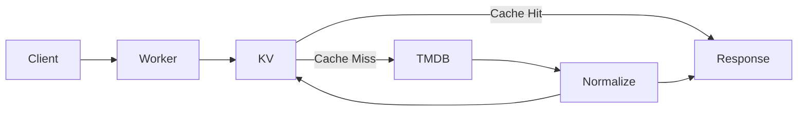

# Movie & Series Metadata API

> **Status:** Draft
> **Purpose:** Opinionated TMDB wrapper with Cloudflare KV caching.

---

# Executive Summary

This service provides a small, stable HTTP API for retrieving movie and TV series metadata using IMDb IDs.

It intentionally hides TMDB behind an application-owned schema. Clients never interact with TMDB directly.

The Worker is responsible for:

- validating requests
- reading/writing Cloudflare KV
- querying TMDB when necessary
- normalizing the response
- returning a stable API

The goal is simplicity, predictable responses, and low operating cost.

---

# Goals

- Accept IMDb IDs as input.
- Return a single normalized response.
- Cache responses in Cloudflare KV.
- Keep deployment serverless.
- Minimize TMDB API usage.
- Run comfortably within Cloudflare's free tier.

## Non-goals

- User accounts
- Write operations
- Search
- Recommendations
- Personalized data
- Full TMDB API compatibility

---

# Architecture



The Worker is intentionally thin. Business logic lives in a small normalization layer.

---

# Request Flow

1. Validate IMDb ID.
2. Build cache key.
3. Read KV.
4. If cached, return immediately.
5. Resolve IMDb ID through TMDB.
6. Fetch metadata.
7. Normalize.
8. Store in KV.
9. Return response.

---

# Public API

## GET /titles/{imdbId}

Examples:

```
GET /titles/tt0133093
GET /titles/tt0088247?lang=es&country=ES
```

Optional query parameters:

- `lang`: conservative TMDB-safe language tag, e.g. `es` or `es-ES`, normalized before forwarding upstream.
- `country`: ISO 3166-1 alpha-2 provider region, e.g. `ES`, normalized to uppercase.
- `cache`: operator cache mode, `refresh` or `bypass` where allowed.

Responses:

- 200 Success
- 400 Invalid IMDb ID
- 404 Title not found
- 500 Unexpected failure

---

# Normalized Model

The API owns its schema.

Example sections include:

- title
- type
- overview
- release
- runtime
- genres
- rating
- cast
- crew
- artwork
- collection
  - movies may include `collection.items[]` with stable string `id`, `imdbId` when resolvable, `title`, `release`, `poster`, and `order`
  - series use `collection: null`; seasons are not collections
- streaming providers

Clients should never depend on TMDB field names.

---

# Cache Strategy

Cache key:

```
title:{imdbId}:v2
title:{imdbId}:v2:lang={lang}
title:{imdbId}:v2:country={country}
title:{imdbId}:v2:lang={lang}:country={country}
```

Guidelines:

- Cache only successful normalized responses.
- Never cache upstream errors.
- Version cache keys when the schema changes.
- TTL should be configurable.
- Normal requests may return stale cached data when TMDB is unavailable.
- `cache=refresh` skips cache reads and replaces cached successful responses.
- `cache=bypass` skips both cache reads and writes.
- Production cache override modes are disabled unless explicitly enabled for operations.

---

# External Dependencies

| Service | Purpose |
|---------|---------|
| TMDB | Source of metadata |
| Cloudflare Workers | API runtime |
| Cloudflare KV | Metadata cache |

---

# Error Handling

- Validate input before calling TMDB.
- Return consistent JSON errors.
- Hide upstream implementation details.
- Log unexpected failures.

---

# Deployment

Single Cloudflare Worker.

Configuration through Wrangler.

Secrets:

- TMDB API key

Bindings:

- KV namespace

Environments:

- local
- development
- production

---

# Implementation Principles

The implementation MUST:

- expose only normalized models
- remain stateless
- avoid unnecessary abstractions
- prefer readability over cleverness
- keep files small and focused
- avoid premature optimization

If something feels over-engineered, simplify it.

---

# Future Enhancements

Possible additions:

- trailers
- watch providers refresh endpoint
- localized metadata
- multiple metadata providers
- background cache refresh

These should not complicate the initial implementation.

---

# Open Questions

- Default cache TTL: 7 days, configurable by Worker environment.
- Manual cache invalidation: out of initial scope; use restricted `cache=refresh` for operator refreshes.
- Background refresh vs lazy refresh: initial implementation uses lazy refresh with stale fallback for normal requests.
- Response schema versioning: cache keys currently use `title:{imdbId}:v2` and typed contracts, without a response-body `schemaVersion` field.

---

# Design Philosophy

This project is intentionally **not** a generic metadata platform.

It is a small, opinionated TMDB wrapper whose primary value is:

- stable responses
- fast cache hits
- simple deployment
- low maintenance
